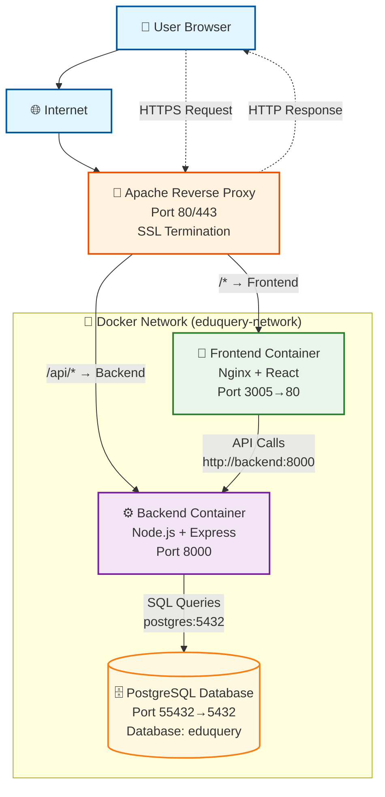
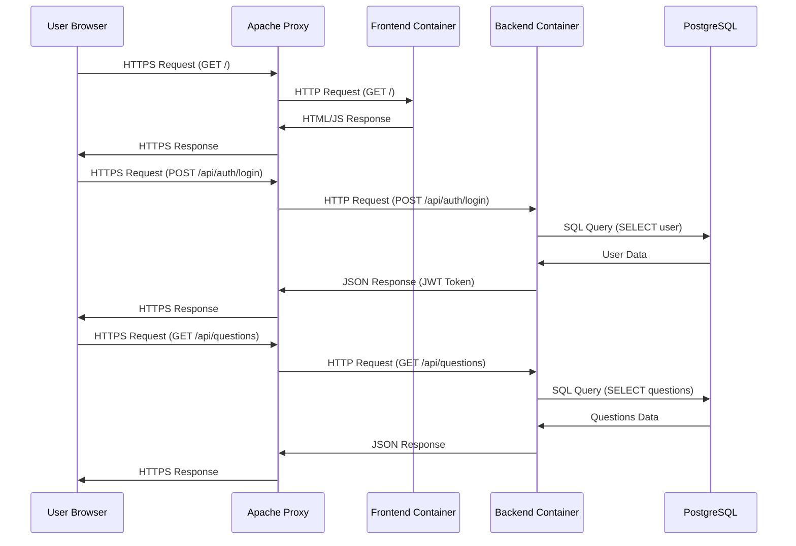

# Question Maker - Architecture Documentation

This document describes the technical architecture of the Question Maker application deployment.

## System Architecture Overview

```
Internet → Apache (Reverse Proxy) → Docker Containers
                                    ├── Frontend (Nginx + React)
                                    ├── Backend (Node.js API)
                                    └── Database (PostgreSQL)
```

## Component Details

### 1. Apache Reverse Proxy
**Role**: Entry point, SSL termination, request routing
**Configuration**: `/etc/httpd/conf.d/question-maker.conf`
**Ports**: 80 (HTTP), 443 (HTTPS)

**Routing Logic:**
- `/api/*` → Backend container (port 8000)
- `/*` → Frontend container (port 3005)

### 2. Frontend Container
**Base Image**: nginx:alpine
**Build Process**: Multi-stage Docker build
**Port**: 3005 (external) → 80 (internal)
**Technology Stack**: React + Vite + Nginx

**Build Stages:**
1. **Builder Stage**: Node.js 18 Alpine
   - Installs dependencies
   - Builds React app with Vite
   - Outputs static files to `/app/dist`

2. **Production Stage**: nginx:alpine
   - Copies built files from builder stage
   - Serves static files
   - Handles React Router with `try_files`

### 3. Backend Container
**Base Image**: node:18-alpine
**Port**: 8000
**Technology Stack**: Node.js + Express.js
**Database**: PostgreSQL (separate container)

**Features:**
- RESTful API endpoints
- Authentication middleware
- Database connection pooling
- Health check endpoint

### 4. Database Container
**Base Image**: postgres:15-alpine
**Port**: 55432 (external) → 5432 (internal)
**Database**: eduquery
**User**: postgres

**Features:**
- Persistent data storage
- Health checks
- Initialization scripts support

## Network Architecture

### Docker Network
**Name**: eduquery-network
**Type**: Bridge network
**Purpose**: Container-to-container communication

### Port Mapping
```
Host Port → Container Port → Service
3005     → 80            → Frontend (Nginx)
8000     → 8000          → Backend (Node.js)
55432    → 5432          → Database (PostgreSQL)
```

### Internal Communication
```
Frontend → Backend: http://backend:8000/api/*
Apache → Frontend: http://localhost:3005/*
Apache → Backend: http://localhost:8000/api/*
```

## Data Flow

### 1. User Request Flow
```
User Browser
    ↓ HTTPS Request
Apache Reverse Proxy
    ↓ Route Decision
    ├── /api/* → Backend Container
    └── /* → Frontend Container
```

### 2. API Request Flow
```
Frontend Container
    ↓ HTTP Request (internal)
Backend Container
    ↓ SQL Query
PostgreSQL Container
    ↓ Response
Backend Container
    ↓ JSON Response
Frontend Container
    ↓ HTML/JS Response
Apache
    ↓ HTTPS Response
User Browser
```

### 3. Static Asset Flow
```
Frontend Container (Nginx)
    ↓ Static File
Apache
    ↓ HTTPS Response
User Browser
```

## Security Architecture

### 1. Network Isolation
- **Docker Network**: Isolates containers from host
- **Port Mapping**: Only necessary ports exposed
- **Internal Communication**: Containers communicate via Docker network

### 2. Authentication Flow
```
User Login
    ↓ Credentials
Frontend
    ↓ POST /api/auth/login
Backend
    ↓ Validate Credentials
Database
    ↓ User Data
Backend
    ↓ JWT Token
Frontend
    ↓ Store Token
Subsequent Requests
    ↓ Bearer Token
Backend
    ↓ Validate Token
```

### 3. CORS Handling
- **Problem**: Cross-origin requests blocked
- **Solution**: Apache proxy eliminates CORS
- **Result**: All requests appear same-origin

## Deployment Architecture

### 1. Build Process
```
Source Code
    ↓ Git Clone
Server
    ↓ Docker Build
    ├── Frontend Image (Nginx + React)
    └── Backend Image (Node.js)
    ↓ Docker Compose Up
Running Containers
```

### 2. Configuration Management
```
Environment Variables
    ↓ .env file
Docker Compose
    ↓ Container Environment
Application Containers
```

### 3. Data Persistence
```
PostgreSQL Data
    ↓ Docker Volume
Host Filesystem
    ↓ Persistent Storage
Container Restart
    ↓ Data Preserved
```

## Performance Considerations

### 1. Frontend Optimization
- **Static Assets**: Served by Nginx with caching headers
- **Build Optimization**: Vite production build
- **Asset Compression**: Gzip enabled in Nginx
- **CDN Ready**: Static assets can be moved to CDN

### 2. Backend Optimization
- **Connection Pooling**: Database connections reused
- **Health Checks**: Container health monitoring
- **Restart Policy**: Automatic container restart
- **Resource Limits**: Can be added to containers

### 3. Database Optimization
- **Persistent Storage**: Data survives container restarts
- **Health Checks**: Database availability monitoring
- **Connection Limits**: PostgreSQL connection management

## Monitoring and Logging

### 1. Container Logs
```bash
# View logs
docker compose logs frontend
docker compose logs backend
docker compose logs postgres

# Follow logs
docker compose logs -f frontend
```

### 2. Apache Logs
```bash
# Error logs
sudo tail -f /var/log/httpd/error_log

# Access logs
sudo tail -f /var/log/httpd/access_log
```

### 3. Health Monitoring
```bash
# Container status
docker compose ps

# Health checks
curl -f http://localhost:3005/
curl -f http://localhost:8000/
curl -f http://questionmaker.ok.ubc.ca/api/
```

## Scalability Considerations

### 1. Horizontal Scaling
- **Frontend**: Multiple Nginx containers behind load balancer
- **Backend**: Multiple API containers with shared database
- **Database**: Read replicas for read-heavy workloads

### 2. Vertical Scaling
- **Resource Limits**: CPU and memory limits per container
- **Database Tuning**: PostgreSQL configuration optimization
- **Caching**: Redis for session storage and caching

### 3. Load Balancing
- **Apache**: Can be replaced with dedicated load balancer
- **Docker Swarm**: Container orchestration
- **Kubernetes**: Full container orchestration platform

## Backup and Recovery

### 1. Database Backup
```bash
# Create backup
docker exec eduquery-postgres pg_dump -U postgres eduquery > backup.sql

# Restore backup
docker exec -i eduquery-postgres psql -U postgres eduquery < backup.sql
```

### 2. Configuration Backup
```bash
# Backup Docker Compose files
cp docker-compose.yml docker-compose.yml.backup
cp .env .env.backup

# Backup Apache configuration
sudo cp /etc/httpd/conf.d/question-maker.conf question-maker.conf.backup
```

### 3. Disaster Recovery
1. **Container Recovery**: `docker compose up -d`
2. **Data Recovery**: Restore from database backup
3. **Configuration Recovery**: Restore configuration files

## Technology Stack Summary

### Frontend
- **Framework**: React 18
- **Build Tool**: Vite
- **Web Server**: Nginx
- **Styling**: Tailwind CSS
- **Routing**: React Router

### Backend
- **Runtime**: Node.js 18
- **Framework**: Express.js
- **Database**: PostgreSQL 15
- **Authentication**: JWT
- **API**: RESTful

### Infrastructure
- **Containerization**: Docker + Docker Compose
- **Reverse Proxy**: Apache HTTP Server
- **Operating System**: Linux (UBC Server)
- **Domain**: questionmaker.ok.ubc.ca

## Architecture Diagram



## Request Flow Diagram



---

**Architecture Version**: 1.0  
**Last Updated**: October 2024  
**Deployment**: Production

