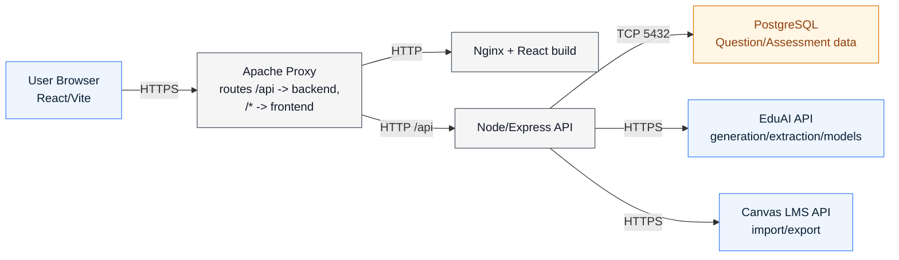

# Question Maker — Developer Guide

Concise technical guide for contributors. This mirrors current app behavior and complements the end-user guide in `app/frontend/src/pages/HelpPage.tsx`.

## System Architecture (high level)

## Backend (`app/backend`)

- Models & associations:
  - Core tables: `User`, `Course`, `Topics`, `Question_Metadata`, `Variants`, `Assessments`, `AssessmentSections`, `SectionVariants`, `CanvasIntegration`, `CanvasCourseMapping`, `BugReport`.
- Middleware:
  - `middleware/auth.js` (JWT guard), `middleware/errorHandler.js` (404 + error responses).
- Services:
  - Auth: `services/authService.js` (register/login/JWT, bcrypt, `isBugReportAdmin` flag projection).
  - Questions/variants: `services/questionService.js` (CRUD, topic normalization, extraction save flow, ordering).
  - Assessments/sections: `services/assessmentService.js`, `services/assessmentSectionService.js`.
  - AI: `services/aiService.js` (extraction wrapper), `services/eduaiService.js` (models/generation/chat proxy).
  - Canvas: `services/canvasService.js` (integration storage, quiz import/export).
  - Assessment variant workflow: `services/assessmentVariantService.js`.
  - Bug reports: `services/bugReportService.js` (create/list/status update + admin email checks).
  - Encryption: `utils/encryption.js` (AES-256-GCM for Canvas credentials).
- Routes:
  - `/api/auth` (`routes/auth.js`)
  - `/api/course` (`routes/course.js`)
  - `/api/questions` + `/api/questions/*` (`routes/questions.js`, `routes/variants.js`)
  - `/api/assessments` (`routes/assessments.js`)
  - `/api/eduai` (`routes/eduai.js`)
  - `/api/canvas` (`routes/canvas.js`)
  - `/api/assessment-variant` (`routes/assessmentVariant.js`)
  - `/api/bug-reports` (`routes/bugReports.js`)

## Frontend (`app/frontend`)

- App wiring: `src/main.tsx`, `src/App.tsx`.
  - Routes include `/login`, `/courses`, `/home`, `/assessments/:id/builder`, `/assessment-variant`, `/help`, `/admin/bug-reports`.
- State/providers:
  - `contexts/AuthContext.tsx`, `GuidedTourContext.tsx`, `BugReportContext.tsx`.
- API client:
  - `services/api.ts` (axios token injection + 401 handling).
- Domain services:
  - `services/authService.ts`, `questionService.ts`, `assessmentService.ts`, `courseService.ts`, `eduaiService.ts`, `canvasService.ts`, `assessmentVariantService.ts`, `bugReportApi.ts`.
  - `services/apiKeyStorage.ts` stores provider API keys in browser local storage (encrypted at rest in the browser context).
- Key screens:
  - `pages/CourseSelectionPage.tsx`, `Homepage.tsx`, `AssessmentBuilderPage.tsx`, `AssessmentVariantPage.tsx`, `HelpPage.tsx`, `BugReportsAdminPage.tsx`.

## Main Product Flows (Code Pointers)

### 1) Auth (Login/Register + role flags)
- UI: `pages/LoginPage.tsx`.
- Backend: `routes/auth.js` -> `services/authService.js`.
- Notes:
  - New users are seeded with starter data (`seedNewUserService.js`).
  - Public auth payload includes `isBugReportAdmin` derived from email.

### 2) Course selection + onboarding
- UI:
  - `pages/CourseSelectionPage.tsx` (entry after login).
  - `components/profile/ProfileCoursesDialog.tsx` to link/import courses + topics.
- Backend:
  - `routes/course.js` for local course/topic CRUD.
  - `routes/eduai.js` for EduAI course/topic listing.

### 3) Guided tour
- UI:
  - Triggered from top nav and help page.
  - `contexts/GuidedTourContext.tsx` + `tour/tourSteps.ts`.
- Behavior:
  - Can auto-start for newly registered users.
  - Can navigate between `/courses` and `/home` as part of tour step actions.

### 4) Questions and variants (manual + AI)
- UI:
  - `components/questions/AddQuestionDialog.tsx`
  - `components/question-detail/QuestionDetailView.tsx`
- Backend:
  - `routes/questions.js` + `routes/variants.js` -> `services/questionService.js`
  - AI generation via `routes/eduai.js` -> `services/eduaiService.js`.

### 5) Upload file -> OCR -> extract questions
- UI:
  - `components/question-bank/QuestionUploadDialog.tsx` uses pdf.js + Tesseract client-side OCR.
  - Homepage supports background extraction (toast + later review).
- Backend:
  - POST `/api/questions/extract` (extract)
  - POST `/api/questions/extract/save` (persist to question bank, optionally assessment/section).

### 6) Build assessments
- UI:
  - `Homepage.tsx` assessments tab + `AssessmentBuilderPage.tsx`.
  - Section workflows in `components/assessments/*`.
- Backend:
  - `routes/assessments.js` -> `assessmentService.js`, `assessmentSectionService.js`.

### 7) Canvas integration (import + export)
- UI:
  - Export: `components/canvas/CanvasExportDialog.tsx`
  - Import: `components/canvas/CanvasImportDialog.tsx`
- Backend:
  - `routes/canvas.js` -> `canvasService.js`
- Notes:
  - Export and document generation paths are guarded against draft variants.
  - Import supports skipped-question reporting for unsupported Canvas types.

### 8) Document export (TXT + Word)
- UI:
  - `Homepage.tsx` export handlers use `utils/assessmentExport.ts`.
  - TXT and DOCX are generated client-side and downloaded.
- Backend:
  - Not required for file generation.

### 9) Assessment variant workflow (parallel exams + AI judge)
- UI:
  - `pages/AssessmentVariantPage.tsx` (full workflow)
  - `components/assessmentVariant/AssessmentVariantWorkflowPanel.tsx` (builder side panel)
- Backend:
  - `routes/assessmentVariant.js` -> `assessmentVariantService.js`.
- Capabilities:
  - Mark baseline reference exam.
  - Generate bank variants for all/missing slots.
  - Assemble Exam A/B/C with matched structure.
  - Run AI review and export AI review artifacts.

### 10) Bug reporting and admin triage
- UI:
  - Floating report button and modal from `contexts/BugReportContext.tsx` + `components/bug-report/BugReportDialog.tsx`.
  - Admin review page `pages/BugReportsAdminPage.tsx`.
- Backend:
  - `routes/bugReports.js` -> `services/bugReportService.js`.
- Notes:
  - Captures recent console/fetch diagnostics and screenshot in browser (`hooks/useBugReportCapture.ts`).
  - Admin access is email-based (`DEFAULT_BUG_REPORT_ADMIN_EMAIL` plus `BUG_REPORT_ADMIN_EMAILS` env list).

## Environment / Config notes

- Core backend config is centralized in `src/config/settings.js`.
- Important env variables for current features:
  - `EDUAI_API_URL`, `EDUAI_API_KEY`, `EDUAI_IGNORED_COURSE_CODES`
  - `ENCRYPTION_KEY` (required in production; used for Canvas secret encryption)
  - `BUG_REPORT_ADMIN_EMAILS` (comma-separated additional admin emails)

## Integrations

- **EduAI**:
  - Backend proxy client in `services/eduaiService.js`.
  - Frontend model and key UX in `services/eduaiService.ts` + `services/apiKeyStorage.ts`.
- **Canvas LMS**:
  - Import/export via `services/canvasService.js`.
  - Integration credential storage encrypted server-side.
