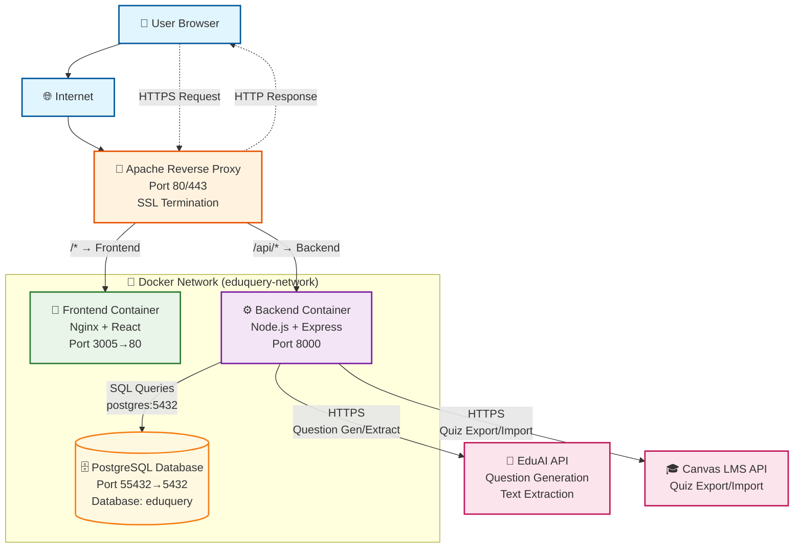

# Question Maker — Developer Guide

Concise technical guide for new contributors. Pairs with the HelpPage.tsx user guide but focuses on how flows are implemented and where to find code.

## System Architecture (high level)

## Backend (app/backend)

- Models & associations:
  - Core tables: `User`, `Course`, `Topics`, `Question_Metadata` (question shell), `Variants` (question text/answers), `Assessments`, `AssessmentSections`, `SectionVariants`, `CanvasIntegration` (encrypted API key), `CanvasCourseMapping`.
- Middleware: `middleware/auth.js` (JWT guard), `middleware/errorHandler.js` (404 + error responses).
- Services (business logic):
  - Auth: `services/authService.js` (register/login/JWT, bcrypt).
  - Questions & variants: `services/questionService.js` (CRUD, validation, per-user scoping via course, secondary topic normalization, bulk create, extraction save flow, order per assessment).
  - Assessments & sections: `services/assessmentService.js`, `services/assessmentSectionService.js` (blueprints, sections, variant links, order updates, removal helpers).
  - AI: `services/aiService.js` (legacy Groq/OpenAI/DeepSeek, text extraction via EduAI), `services/eduaiService.js` (EduAI client, question generation/chat).
  - Canvas: `services/canvasService.js` (integration storage, mock mode, quiz/question export, MCQ parsing).
  - Encryption: `utils/encryption.js` (AES-256-GCM for Canvas API keys).
- Routes (Express):
  - `/api/auth` (`routes/auth.js`)
  - `/api/course` (`routes/course.js`) – courses/topics
  - `/api/questions` (`routes/questions.js`) – metadata + variants + AI generate/extract + approve/save + order
  - `/api/questions/*` (`routes/variants.js`) – variant CRUD by question
  - `/api/assessments` (`routes/assessments.js`) – assessments, sections, section variants, question presence checks
  - `/api/eduai` (`routes/eduai.js`) – chat, generate, list courses/topics, models
  - `/api/canvas` (`routes/canvas.js`) – connect, list courses, export, mappings

## Frontend (app/frontend)

- Entry: `src/main.tsx`, `src/App.tsx` (React Router: login, landing, assessment view, help, optional API test).
- Auth state: `contexts/AuthContext.tsx` (stores token/user, verifies `/api/auth/me`).
- API client: `services/api.ts` (axios with token injector + 401 handling).
- Domain services: `services/authService.ts`, `questionService.ts`, `assessmentService.ts`, `courseService.ts`, `eduaiService.ts`, `canvasService.ts`, `apiKeyStorage.ts` (local encryption of provider API keys).
- Types: `src/types/*.ts` (questions/assessments/courses/topics/auth).
- UI primitives: `components/ui/*` (shadcn/Tailwind).
- Key screens/flows (see next section).

## Main Product Flows with Code Pointers

### 1) Auth (Login/Register)
- UI: `pages/LoginPage.tsx`.
- Frontend service: `services/authService.ts`; context `AuthContext.tsx`.
- Backend: `routes/auth.js` → `services/authService.js` (bcrypt + JWT).

### 2) Onboarding: Add Courses & Topics
- UI: Profile dialog `components/profile/ProfileCoursesDialog.tsx`; course fetch hook `hooks/useCourses.ts`; course list in `components/navigation/TopNavigation.tsx`.
- Backend: `/api/course` routes in `routes/course.js`; model `Course`, `Topics`.
- EduAI import of courses/topics: frontend `eduaiService.listCourses()/listCourseTopics()`, backend proxy `routes/eduai.js` → `services/eduaiService.js`.

### 3) Create Questions Manually
- UI: `components/questions/AddQuestionDialog.tsx`; rendered from `pages/LandingPage.tsx`.
- Backend: POST `/api/questions` → `questionService.createQuestion`; variants created via `/api/questions/:id/variants` → `createVariant`.
- Data: `Question_Metadata` + at least one `Variant`.

### 4) Generate Questions with EduAI (per question)
- UI: Right-hand panel in `AddQuestionDialog` uses `services/eduaiService.ts` to call `/api/eduai/generate-questions`.
- Backend: `routes/eduai.js` → `services/eduaiService.js` (calls external EduAI API with course code/model/apiKeys). Local storage of provider keys encrypted via `apiKeyStorage.ts`.

### 5) Create Variants (Manual or AI)
- UI: `QuestionDetailView.tsx`, `QuestionCard` actions, `AddQuestionDialog` (variant tab).
- Backend: POST `/api/questions/:id/variants` → `questionService.createVariant`; PUT/DELETE via `routes/variants.js`.
- AI variant generation reuses EduAI generate flow (frontend constructs prompt; backend same endpoint).

### 6) Upload Assessment PDF/Image → OCR → Extract → Auto-create
- UI: `components/question-bank/QuestionUploadDialog.tsx`
  - OCR: pdfjs + Tesseract in browser.
  - Calls backend `/api/questions/extract` with text, courseId, model/apiKeys.
  - Review list allows editing difficulty/type/topics, include/exclude.
  - Save: POST `/api/questions/extract/save` (can also create Assessment + Section).
- Backend:
  - `routes/questions.js` → `aiService.extractQuestionsFromText` (delegates to EduAI extraction) and `questionService.saveExtractedQuestions` (creates questions, variants, optional assessment+section, links section variants).
  - Topic fallback/creation handled in `saveExtractedQuestions`.

### 7) Build Assessments (Blueprints, Sections, Matching)
- UI: Assessments tab in `pages/LandingPage.tsx`; detailed builder `pages/AssessmentViewPage.tsx` with panels `pages/assessments/*` and components `components/assessments/*` (GenerateAssessmentModal, SectionCard, CreateSectionPanel, MatchingQuestionsPanel).
- Backend:
  - Assessments CRUD: `routes/assessments.js` → `assessmentService`.
  - Sections & variant links: `routes/assessments.js` → `assessmentSectionService` (create/update/delete sections, add/remove variants, order).
  - Question presence/draft checks: `checkQuestionInAssessments`, `removeQuestionFromAllSections`.
- Data: `Assessments`, `AssessmentSections`, `SectionVariants`, variant `assessmentId`, question `questionOrder` map for ordering inside assessments.

### 8) Export to Canvas
- UI: `components/canvas/CanvasExportDialog.tsx` (invoked from Assessments list/page). Blocks export if any draft variants.
- Backend: POST `/api/canvas/export/:assessmentId` → `canvasService.exportAssessmentToCanvas`:
  - Loads assessment + sections/variants (`assessmentService.getAssessmentById`).
  - Creates Canvas quiz, then posts questions (MCQ parsing in `convertVariantToCanvasQuestion`).
  - Stores mapping in `CanvasCourseMapping`; uses `CanvasIntegration` (API key encrypted).
  - Test mode uses mock data.

### 9) Export to TXT
- UI: `LandingPage.tsx` and `AssessmentViewPage.tsx` contain TXT export logic (client-side blob download) with draft gating.
- Backend: Not required (performed client-side using loaded assessment data).

## Integrations
- **EduAI**: External RAG/chat service. Backend client in `services/eduaiService.js`; endpoints proxy with API key from `.env`. Frontend model picker and provider key handling through `eduaiService.ts` + `apiKeyStorage.ts`.
- **Canvas**: Backend `canvasService.js` handles REST calls or mock mode; API key encrypted at rest; front-end dialog to connect/export.
