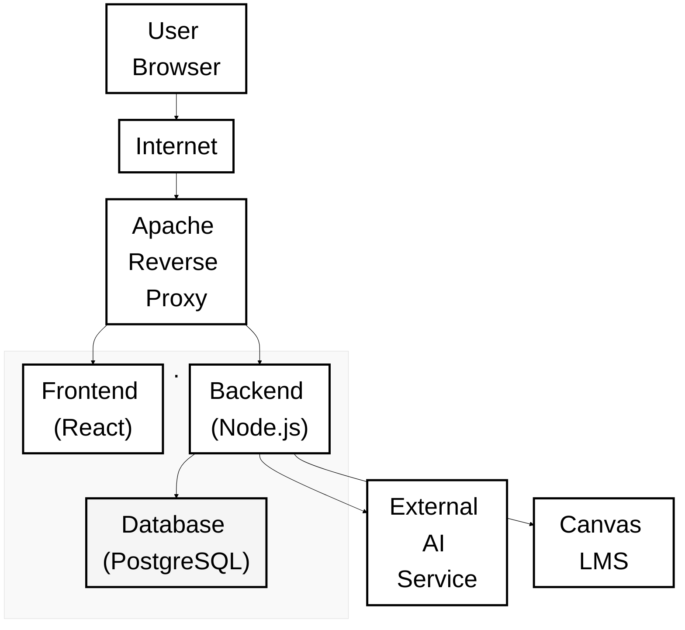

```mermaid
%%{init: {'theme':'base', 'themeVariables': {'fontSize':'45px', 'primaryColor':'#000000', 'primaryTextColor':'#ffffff', 'primaryBorderColor':'#000000', 'lineColor':'#000000', 'secondaryColor':'#ffffff', 'tertiaryColor':'#f9f9f9'}}}%%
graph TB
    %% External Layer
    User[User Browser]
    Internet[Internet]
    
    %% Apache Reverse Proxy
    Apache[Apache Reverse Proxy]
    
    %% Docker Network
    subgraph .
        %% Frontend Container
        Frontend["Frontend (React)"]
        
        %% Backend Container
        Backend["Backend (Node.js)"]
        
        %% Database Container
        Database["Database (PostgreSQL)"]
    end
    
    %% External Services
    EduAI[External AI Service]
    Canvas[Canvas LMS]
    
    %% Request Flow
    User --> Internet
    Internet --> Apache
    
    %% Apache Routing
    Apache --> Backend
    Apache --> Frontend
    
    %% Internal Communication
    Backend --> Database
    
    %% External API Calls
    Backend --> EduAI
    Backend --> Canvas
    
    %% Styling - Black/White only with thick lines
    classDef default fill:#ffffff,stroke:#000000,stroke-width:4px,color:#000000
    classDef database fill:#f5f5f5,stroke:#000000,stroke-width:4px,color:#000000
    
    class User,Internet,Apache,Frontend,Backend,EduAI,Canvas default
    class Database database
```