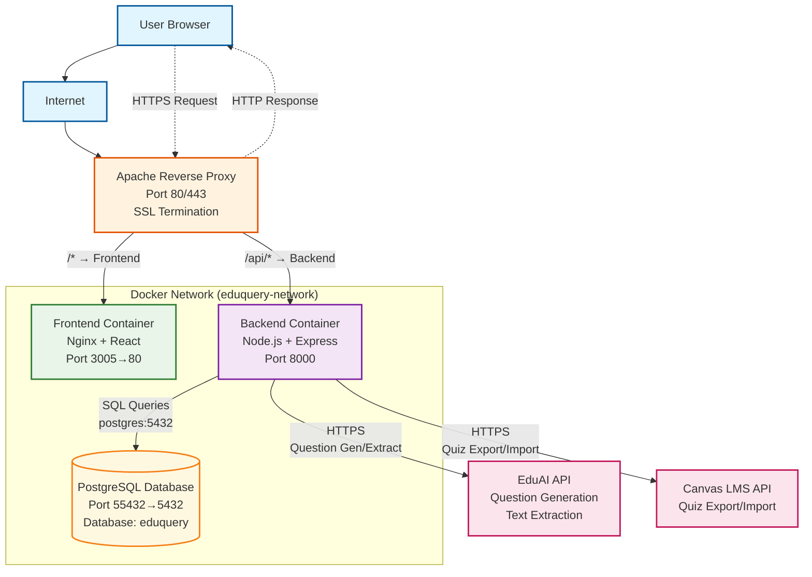

```mermaid
graph TB
    %% External Layer
    User[User Browser]
    Internet[Internet]
    
    %% Apache Reverse Proxy
    Apache[Apache Reverse Proxy<br/>Port 80/443<br/>SSL Termination]
    
    %% Docker Network
    subgraph Docker["Docker Network (eduquery-network)"]
        %% Frontend Container
        Frontend[Frontend Container<br/>Nginx + React<br/>Port 3005→80]
        
        %% Backend Container
        Backend[Backend Container<br/>Node.js + Express<br/>Port 8000]
        
        %% Database Container
        Database[(PostgreSQL Database<br/>Port 55432→5432<br/>Database: eduquery)]
    end
    
    %% External Services
    EduAI[EduAI API<br/>Question Generation<br/>Text Extraction]
    Canvas[Canvas LMS API<br/>Quiz Export/Import]
    
    %% Request Flow
    User --> Internet
    Internet --> Apache
    
    %% Apache Routing
    Apache -->|"/api/* → Backend"| Backend
    Apache -->|"/* → Frontend"| Frontend
    
    %% Internal Communication
    Backend -->|"SQL Queries<br/>postgres:5432"| Database
    
    %% External API Calls
    Backend -->|"HTTPS<br/>Question Gen/Extract"| EduAI
    Backend -->|"HTTPS<br/>Quiz Export/Import"| Canvas
    
    %% Data Flow Labels
    User -.->|"HTTPS Request"| Apache
    Apache -.->|"HTTP Response"| User
    
    %% Styling
    classDef external fill:#e1f5fe,stroke:#01579b,stroke-width:2px
    classDef proxy fill:#fff3e0,stroke:#e65100,stroke-width:2px
    classDef frontend fill:#e8f5e8,stroke:#2e7d32,stroke-width:2px
    classDef backend fill:#f3e5f5,stroke:#7b1fa2,stroke-width:2px
    classDef database fill:#fff8e1,stroke:#f57f17,stroke-width:2px
    classDef extapi fill:#fce4ec,stroke:#c2185b,stroke-width:2px
    
    class User,Internet external
    class Apache proxy
    class Frontend frontend
    class Backend backend
    class Database database
    class EduAI,Canvas extapi
```