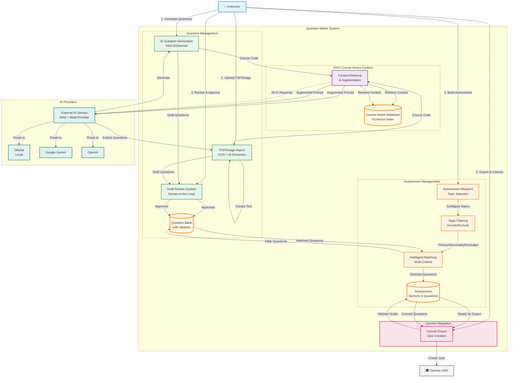

```mermaid
graph TB
    %% User Layer
    Instructor[👤 Instructor]
    
    %% Core System Components
    subgraph QM["Question Maker System"]
        subgraph RAG["RAG Course-Aware Context"]
            VectorDB[(Course Vector Database<br/>PGVector Index)]
            ContextRetrieval[Context Retrieval<br/>& Augmentation]
        end
        
        subgraph QMgt["Question Management"]
            AIGen[AI Question Generation<br/>RAG-Enhanced]
            PDFImport[PDF/Image Import<br/>OCR + AI Extraction]
            Review[Draft Review System<br/>Human-in-the-Loop]
            QuestionBank[(Question Bank<br/>with Variants)]
        end
        
        subgraph AMgt["Assessment Management"]
            Blueprint[Assessment Blueprint<br/>Topic Selection]
            TopicFilter[Topic Filtering<br/>Include/Exclude]
            Matching[Intelligent Matching<br/>Multi-Criteria]
            Assessment[(Assessment<br/>Sections & Questions)]
        end
        
        subgraph CanvasInt["Canvas Integration"]
            Export[Canvas Export<br/>Quiz Creation]
        end
    end
    
    %% External Services
    subgraph AI["AI Providers"]
        EduAI[External AI Service<br/>RAG + Multi-Provider]
        Ollama[Ollama<br/>Local]
        Gemini[Google Gemini]
        OpenAI[OpenAI]
    end
    
    Canvas[🎓 Canvas LMS]
    
    %% User Interactions
    Instructor -->|1. Generate Questions| AIGen
    Instructor -->|2. Upload PDF/Image| PDFImport
    Instructor -->|3. Review & Approve| Review
    Instructor -->|4. Build Assessment| Blueprint
    Instructor -->|5. Export to Canvas| Export
    
    %% Question Generation Flow
    AIGen -->|Course Code| ContextRetrieval
    ContextRetrieval -->|Retrieve Context| VectorDB
    ContextRetrieval -->|Augmented Prompt| EduAI
    EduAI -->|Generate| AIGen
    AIGen -->|Draft Questions| Review
    Review -->|Approved| QuestionBank
    
    %% PDF Import Flow
    PDFImport -->|Extract Text| PDFImport
    PDFImport -->|Course Code| ContextRetrieval
    ContextRetrieval -->|Retrieve Context| VectorDB
    ContextRetrieval -->|Augmented Prompt| EduAI
    EduAI -->|Extract Questions| PDFImport
    PDFImport -->|Draft Questions| Review
    Review -->|Approved| QuestionBank
    
    %% Assessment Building Flow
    Blueprint -->|Configure Topics| TopicFilter
    TopicFilter -->|Primary/Secondary/Excluded| Matching
    Matching -->|Filter Questions| QuestionBank
    QuestionBank -->|Matched Questions| Matching
    Matching -->|Selected Questions| Assessment
    Assessment -->|Ready for Export| Export
    
    %% Canvas Export Flow
    Export -->|Validate Drafts| Assessment
    Assessment -->|Convert Questions| Export
    Export -->|Create Quiz| Canvas
    
    %% AI Provider Selection
    EduAI -->|Route to| Ollama
    EduAI -->|Route to| Gemini
    EduAI -->|Route to| OpenAI
    
    %% RAG Integration (shown as background process)
    ContextRetrieval -.->|All AI Requests| EduAI
    
    %% Styling
    classDef user fill:#e3f2fd,stroke:#1976d2,stroke-width:2px
    classDef rag fill:#f3e5f5,stroke:#7b1fa2,stroke-width:2px
    classDef question fill:#e8f5e9,stroke:#388e3c,stroke-width:2px
    classDef assessment fill:#fff3e0,stroke:#f57c00,stroke-width:2px
    classDef canvas fill:#fce4ec,stroke:#c2185b,stroke-width:2px
    classDef ai fill:#e0f2f1,stroke:#00796b,stroke-width:2px
    classDef external fill:#f5f5f5,stroke:#616161,stroke-width:2px
    classDef database fill:#fff8e1,stroke:#f57f17,stroke-width:3px
    
    class Instructor user
    class VectorDB,ContextRetrieval rag
    class AIGen,PDFImport,Review,QuestionBank question
    class Blueprint,TopicFilter,Matching,Assessment assessment
    class Export,CanvasInt canvas
    class EduAI,Ollama,Gemini,OpenAI ai
    class Canvas external
    class QuestionBank,Assessment,VectorDB database
```
