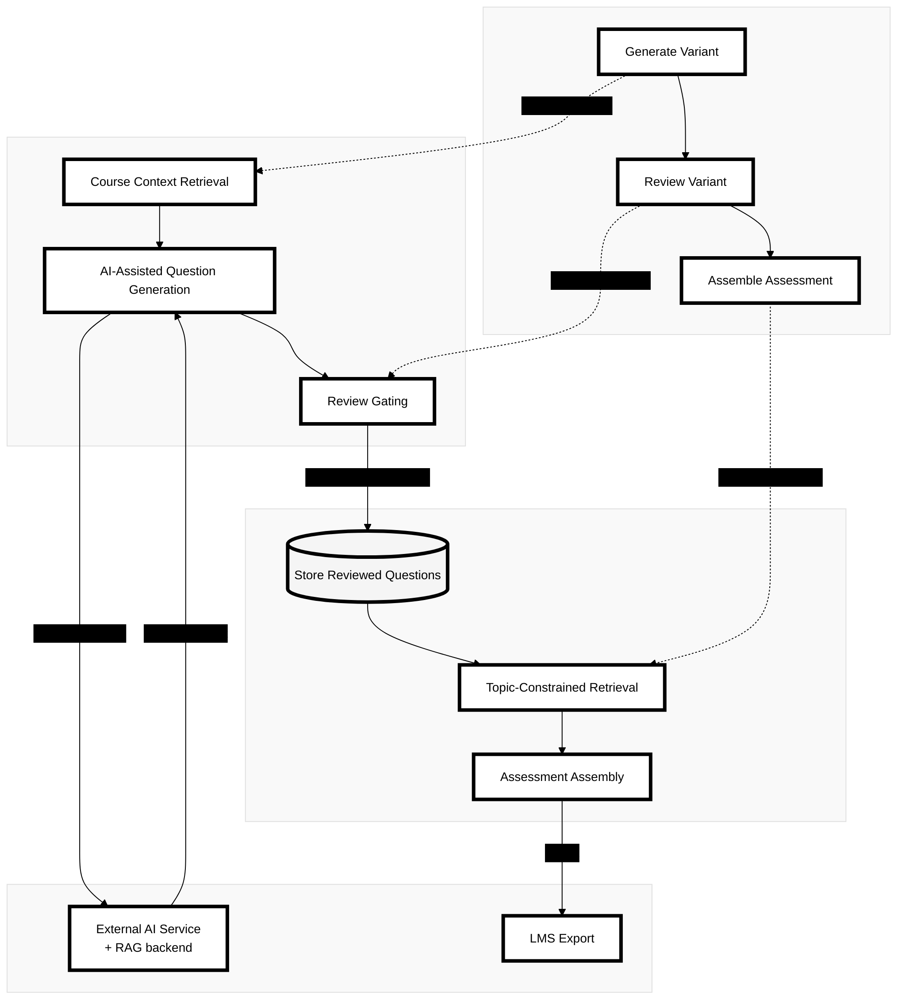

```mermaid
%%{init: {'theme':'base', 'flowchart': {'useMaxWidth': false}, 'themeVariables': {'fontSize':'14px', 'primaryColor':'#000000', 'primaryTextColor':'#000000', 'primaryBorderColor':'#000000', 'lineColor':'#000000', 'secondaryColor':'#000000', 'tertiaryColor':'#f9f9f9', 'textColor':'#000000'}}}%%
graph TB
    %% Row 1: Instructor Actions
    subgraph Row1[" "]
        direction LR
        Request[Generate Variant]
        ReviewAction[Review Variant]
        Assemble[Assemble Assessment]
        Request --> ReviewAction
        ReviewAction --> Assemble
    end

    %% Row 2: Core workflow (first half)
    subgraph Row2[" "]
        direction LR
        RAG[Course Context Retrieval]
        Generation[AI-Assisted Question Generation]
        ReviewGate[Review Gating]
        RAG --> Generation
        Generation --> ReviewGate
    end

    %% Row 3: Core workflow (second half) + store
    subgraph Row3[" "]
        direction LR
        QuestionStore[( Store Reviewed Questions)]
        TopicRetrieval[Topic-Constrained Retrieval]
        AssessmentAssembly[Assessment Assembly]
        QuestionStore --> TopicRetrieval
        TopicRetrieval --> AssessmentAssembly
    end

    %% Row 4: External
    subgraph Row4[" "]
        direction LR
        AIService[External AI Service <br/> + RAG backend]
        LMSExport[LMS Export]
    end

    %% Vertical flow within core
    ReviewGate -->|Reviewed content only| QuestionStore

    %% Instructor → Core (directional triggers)
    Request -.->|requests context| RAG
    ReviewAction -.->|submits for review| ReviewGate
    Assemble -.->|invokes generation| TopicRetrieval

    %% Core ↔ External
    Generation -->|prompt + context| AIService
    AIService -->|generated draft| Generation
    AssessmentAssembly -->|export| LMSExport

    %% Styling - greyscale, large text (match architecture.md)
    classDef default fill:#ffffff,stroke:#000000,stroke-width:4px,color:#000000
    classDef database fill:#f5f5f5,stroke:#000000,stroke-width:4px,color:#000000

    class Request,ReviewAction,Assemble,RAG,Generation,ReviewGate,TopicRetrieval,AssessmentAssembly,AIService,LMSExport default
    class QuestionStore database
```

<!-- Render in a 600×600 container for square aspect ratio, e.g. 
 -->
