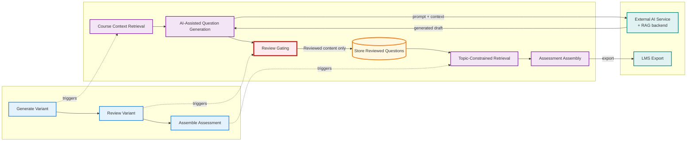

```mermaid
graph LR
    %% Column 1: Instructor Actions (Left, Thin)
    subgraph Col1[" "]
        direction TB
        Request[Generate Variant]
        ReviewAction[Review Variant]
        Assemble[Assemble Assessment]
        
        Request --> ReviewAction
        ReviewAction --> Assemble
    end
    
    %% Column 2: Core Question Maker Workflow (Center, Main - 60-70%)
    subgraph Col2[" "]
        direction TB
        RAG[Course Context Retrieval]
        Generation[AI-Assisted Question Generation]
        ReviewGate[Review Gating]
        QuestionStore[( Store Reviewed Questions)]
        TopicRetrieval[Topic-Constrained Retrieval]
        AssessmentAssembly[Assessment Assembly]
        
        RAG --> Generation
        Generation --> ReviewGate
        ReviewGate -->|Reviewed content only| QuestionStore
        QuestionStore --> TopicRetrieval
        TopicRetrieval --> AssessmentAssembly
    end
    
    %% Column 3: External Interfaces (Right, Thin)
    subgraph Col3[" "]
        direction TB
        AIService[External AI Service <br/> + RAG backend]
        LMSExport[LMS Export]
    end
    
    %% Connections from Column 1 to Column 2
    Request -.->|triggers| RAG
    ReviewAction -.->|triggers| ReviewGate
    Assemble -.->|triggers| TopicRetrieval
    
    %% Connections from Column 2 to Column 3 (our system drives external services)
    Generation -->|prompt + context| AIService
    AIService -->|generated draft| Generation
    AssessmentAssembly -->|export| LMSExport
    
    %% Styling
    classDef instructor fill:#e3f2fd,stroke:#1976d2,stroke-width:2px
    classDef core fill:#f3e5f5,stroke:#7b1fa2,stroke-width:2px
    classDef reviewGate fill:#ffebee,stroke:#c62828,stroke-width:4px
    classDef database fill:#fff8e1,stroke:#f57f17,stroke-width:3px
    classDef external fill:#e0f2f1,stroke:#00796b,stroke-width:2px
    
    class Request,ReviewAction,Assemble instructor
    class RAG,Generation,TopicRetrieval,AssessmentAssembly core
    class ReviewGate reviewGate
    class QuestionStore database
    class AIService,LMSExport external
```
