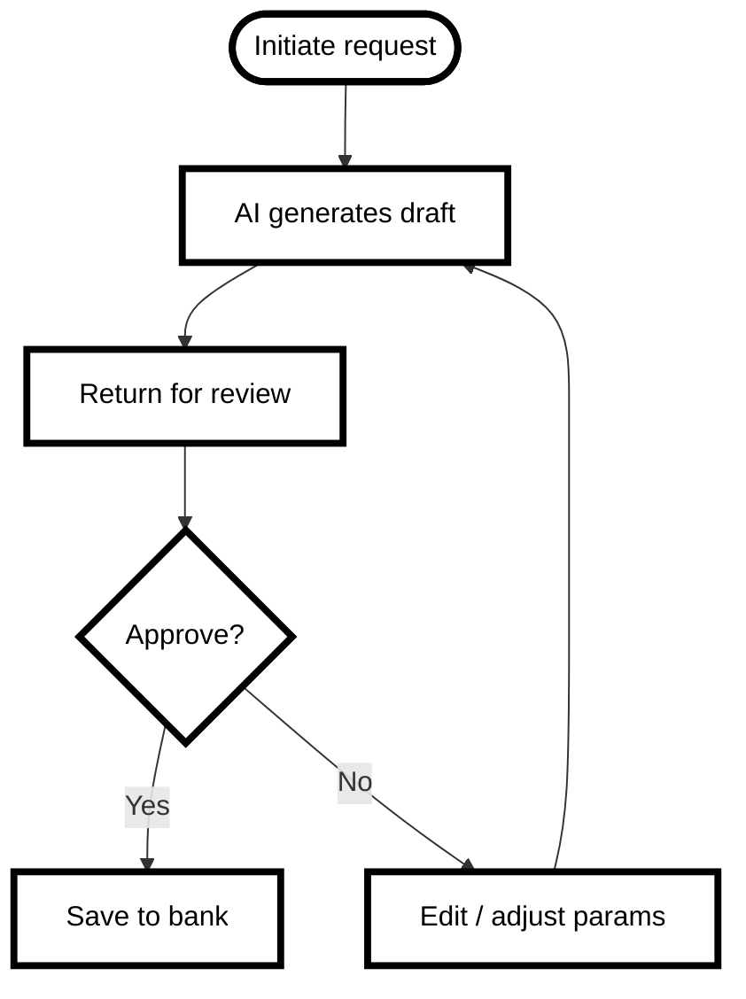

```mermaid
flowchart TD
    Start([Initiate request]) --> AI[AI generates draft]
    AI --> Review[Return for review]
    Review --> Gate{Approve?}
    Gate -->|Yes| Save[Save to bank]

    %% loop as a side branch (keeps height down)
    Gate -->|No| Revise[Edit / adjust params]
    Revise --> AI

    %% Styling
    classDef default fill:#ffffff,stroke:#000000,stroke-width:4px,color:#000000

```