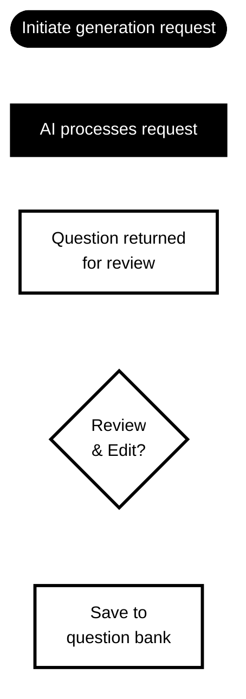

```mermaid
%%{init: {'theme':'dark', 'themeVariables': {'fontSize':'16px', 'primaryColor':'#000000', 'primaryTextColor':'#ffffff', 'primaryBorderColor':'#ffffff', 'lineColor':'#ffffff', 'arrowheadColor':'#ffffff', 'secondaryColor':'#ffffff', 'tertiaryColor':'#000000', 'background':'#000000', 'edgeLabelBackground':'#ffffff', 'edgeLabelColor':'#000000', 'textColor':'#ffffff', 'mainBkgColor':'#000000', 'secondBkgColor':'#000000'}}}%%
graph TB
    Start([Initiate generation request]) --> AIProcessing[AI processes request]
    
    AIProcessing --> Review[Question returned<br/>for review]
    
    Review --> Edit{Review<br/>& Edit?}
    
    Edit -->|Needs changes| Review
    Edit -->|Approved| Save[Save to<br/>question bank]

    %% Styling - Black/White only with thick lines for readability
    classDef default fill:#ffffff,stroke:#000000,stroke-width:3px,color:#000000
    classDef blackNode fill:#000000,stroke:#ffffff,stroke-width:3px,color:#ffffff
    
    %% Edge styling for visibility - all arrows white and thick
    linkStyle 0 stroke:#ffffff,stroke-width:3px,color:#ffffff
    linkStyle 1 stroke:#ffffff,stroke-width:3px,color:#ffffff
    linkStyle 2 stroke:#ffffff,stroke-width:3px,color:#ffffff
    linkStyle 3 stroke:#ffffff,stroke-width:3px,color:#ffffff
    linkStyle 4 stroke:#ffffff,stroke-width:3px,color:#ffffff
    
    class Review,Edit,Save default
    class Start,AIProcessing blackNode

```