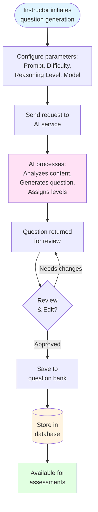

```mermaid
flowchart TB
    Start([Instructor initiates<br/>question generation]) --> Configure[Configure parameters:<br/>Prompt, Difficulty,<br/>Reasoning Level, Model]
    
    Configure --> Generate[Send request to<br/>AI service]
    
    Generate --> AIProcessing[AI processes:<br/>Analyzes content,<br/>Generates question,<br/>Assigns levels]
    
    AIProcessing --> Review[Question returned<br/>for review]
    
    Review --> Edit{Review<br/>& Edit?}
    
    Edit -->|Needs changes| Review
    Edit -->|Approved| Save[Save to<br/>question bank]
    
    Save --> Store[(Store in<br/>database)]
    
    Store --> Available[Available for<br/>assessments]
    
    style Start fill:#e1f5ff
    style Store fill:#fff4e1
    style AIProcessing fill:#ffe1f5
    style Available fill:#e1ffe1
```