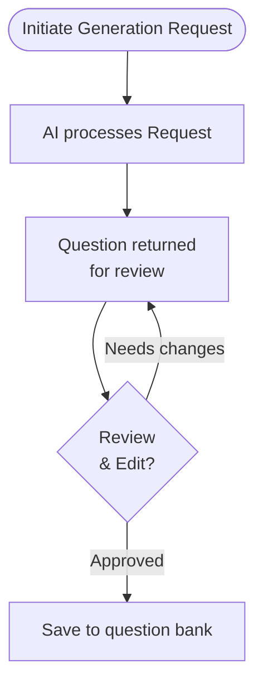

```mermaid
flowchart TB
    Start([Initiate Generation Request]) --> 
    
    AIProcessing[AI processes Request]
    
    AIProcessing --> Review[Question returned<br/>for review]
    
    Review --> Edit{Review<br/>& Edit?}
    
    Edit -->|Needs changes| Review
    Edit -->|Approved| Save[Save to question bank]

```