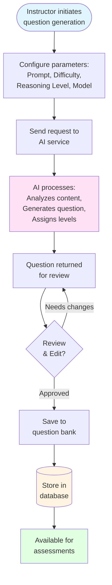

# AI-Powered Question Generation System: High-Level Overview

## System Purpose

This system enables educators to automatically generate educational questions using artificial intelligence. The system allows instructors to create variations of questions with different difficulty levels and cognitive complexity, supporting diverse assessment needs while maintaining consistency with course content.

## Core Workflow

## Key Features

### 1. **Intelligent Question Generation**
   - The system uses advanced AI models to generate educational questions based on instructor-provided prompts
   - Questions are automatically categorized by difficulty (easy, medium, hard) and cognitive reasoning level (factual, analytical, application)
   - Generated questions maintain alignment with course topics and learning objectives

### 2. **Question Variants**
   - Instructors can create multiple variations of a base question
   - Each variant can have different difficulty levels, reasoning requirements, or contextual framing
   - Variants are linked to their base question, maintaining pedagogical relationships

### 3. **Quality Control**
   - All AI-generated questions are marked for instructor review
   - Instructors can edit, refine, or reject generated content before saving
   - Questions can be saved as drafts for later refinement or marked as reviewed and ready for use

### 4. **Metadata Management**
   - Questions are organized by course and topic
   - Each question includes metadata such as:
     - Primary and secondary course topics
     - Question type (multiple choice, short answer, long answer)
     - Difficulty and reasoning level
     - AI generation status
     - Review status

## System Architecture (Conceptual)

### User Interface Layer
- **Question Bank**: Displays all available questions with filtering and search capabilities
- **Question Generation Dialog**: Interface for configuring and generating new questions
- **Review Interface**: Allows instructors to review, edit, and approve generated questions

### Processing Layer
- **AI Integration**: Connects to external AI services for question generation
- **Content Analysis**: Processes course materials and topics to inform question generation
- **Validation**: Ensures generated questions meet quality and format requirements

### Data Layer
- **Question Metadata**: Stores high-level question information (description, course, topics, type)
- **Question Variants**: Stores specific question text, answers, difficulty, and reasoning levels
- **Relationships**: Maintains links between base questions and their variants

## Research Applications

This system supports educational research in several ways:

1. **Scalability**: Enables rapid generation of large question banks for comprehensive assessments
2. **Consistency**: Maintains consistent difficulty and cognitive complexity across question variants
3. **Adaptability**: Allows customization of questions for different learning contexts
4. **Traceability**: Tracks which questions are AI-generated and their review status
5. **Pedagogical Alignment**: Ensures questions align with specific course topics and learning objectives

## Quality Assurance Process

1. **Generation**: AI creates question based on instructor specifications
2. **Initial Review**: System validates format and completeness
3. **Instructor Review**: Human expert reviews content for accuracy and appropriateness
4. **Refinement**: Instructor can edit or regenerate if needed
5. **Approval**: Question marked as reviewed and ready for use
6. **Deployment**: Question becomes available in the question bank for assessment creation

## Benefits for Educational Practice

- **Time Efficiency**: Reduces time needed to create diverse question sets
- **Variety**: Enables creation of multiple question variants for different assessment contexts
- **Consistency**: Maintains alignment with learning objectives across question variations
- **Flexibility**: Supports different difficulty levels and cognitive requirements
- **Quality Control**: Human oversight ensures educational value and accuracy

