# Question Variant Creation Workflow

```mermaid
flowchart TD
    Start([User clicks 'Create Variant' button]) --> OpenDialog[AddQuestionDialog opens<br/>presetVariant prop set<br/>AddQuestionDialog.tsx:151-162]
    
    OpenDialog --> AddParams[User adds parameters:<br/>- generationPrompt<br/>- generationModel<br/>- generationDifficulty<br/>- generationReasoningLevel<br/>- API keys if needed<br/>AddQuestionDialog.tsx:1070-1236]
    
    AddParams --> ClickGenerate[User clicks 'Generate' button<br/>handleGenerateWithAI called<br/>AddQuestionDialog.tsx:442]
    
    ClickGenerate --> ValidateParams{Validate inputs:<br/>- courseId exists<br/>- courseCode resolved<br/>- prompt not empty<br/>AddQuestionDialog.tsx:443-460}
    
    ValidateParams -->|Invalid| ShowError[Show error message<br/>AddQuestionDialog.tsx:444-459]
    ValidateParams -->|Valid| BuildRequest[Build request payload:<br/>- promptWithTopics<br/>- difficultyDistribution<br/>- reasoningDistribution<br/>- apiKeys<br/>AddQuestionDialog.tsx:466-528]
    
    BuildRequest --> CallFrontendService[Call eduaiService.generateQuestions<br/>Frontend service layer<br/>AddQuestionDialog.tsx:521-529]
    
    CallFrontendService --> BackendRoute[POST /api/eduai/generate-questions<br/>Backend route handler<br/>eduai.js:64-129]
    
    BackendRoute --> ValidateBackend{Validate request:<br/>- prompt exists<br/>- courseCode exists<br/>eduai.js:78-82}
    
    ValidateBackend -->|Invalid| ReturnError[Return 400 error<br/>eduai.js:79-81]
    ValidateBackend -->|Valid| CallBackendService[Call eduaiService.generateQuestions<br/>Backend service layer<br/>eduai.js:94-102]
    
    CallBackendService --> BuildSystemPrompt[Build system prompt with:<br/>- numQuestions<br/>- difficultyDistribution<br/>- reasoningDistribution<br/>- JSON format requirements<br/>eduaiService.js:141-179]
    
    BuildSystemPrompt --> CallEduAIAPI[POST to EduAI /api/chat<br/>with system + user prompts<br/>eduaiService.js:186-195]
    
    CallEduAIAPI --> ParseResponse[Parse JSON response:<br/>- Extract question array<br/>- Validate structure<br/>- Handle error objects<br/>eduaiService.js:198-226]
    
    ParseResponse --> NormalizeQuestions[Normalize questions:<br/>- content, description<br/>- difficulty, reasoning_level<br/>- type, answer<br/>- primary_topic_id<br/>- secondary_topic_ids<br/>eduaiService.js:246-295]
    
    NormalizeQuestions --> ReturnToFrontend[Return normalized questions<br/>eduai.js:104-115]
    
    ReturnToFrontend --> UpdateForm[Update form state with:<br/>- variantText: generated.content<br/>- variantDifficulty: inferred<br/>- variantReasoningLevel: inferred<br/>- variantAnswer: resolved<br/>- primaryTopicId: resolved<br/>- variantSecondaryTopics: resolved<br/>AddQuestionDialog.tsx:549-612]
    
    UpdateForm --> SetAIGenerated[Set isAiGenerated = true<br/>Show success toast<br/>AddQuestionDialog.tsx:614-618]
    
    SetAIGenerated --> UserReview[User reviews generated question<br/>Can edit fields if needed]
    
    UserReview --> ClickSave[User clicks 'Save' button<br/>handleSubmit called<br/>AddQuestionDialog.tsx:656]
    
    ClickSave --> ValidateSave{Validate form:<br/>- variantText not empty<br/>- baseSelection exists variant mode<br/>AddQuestionDialog.tsx:665-677}
    
    ValidateSave -->|Invalid| ShowSaveError[Show validation error<br/>AddQuestionDialog.tsx:666-676]
    ValidateSave -->|Valid| CreateQuestionMeta[Create question metadata<br/>questionService.createQuestion<br/>AddQuestionDialog.tsx:722-728]
    
    CreateQuestionMeta --> CreateVariant[Create variant with:<br/>- questionText<br/>- difficulty, reasoningLevel<br/>- answer<br/>- assessmentId<br/>- secondaryTopicsId<br/>- referenceId<br/>- isAiGenerated: true<br/>- isDraft: !markAsReviewed<br/>AddQuestionDialog.tsx:730-740]
    
    CreateVariant --> SaveToDB[(Save to Database)]
    
    SaveToDB --> QuestionMetadata[Question_Metadata table:<br/>- description<br/>- courseId<br/>- primaryTopicId<br/>- type<br/>questionService.js:93-99]
    
    SaveToDB --> VariantsTable[Variants table:<br/>- questionText<br/>- difficulty<br/>- reasoningLevel<br/>- answer<br/>- assessmentId<br/>- secondaryTopicsId<br/>- referenceId<br/>- isAiGenerated<br/>- isDraft<br/>questionService.js:493-503]
    
    VariantsTable --> ReturnQuestion[Return hydrated question<br/>with all associations<br/>AddQuestionDialog.tsx:742]
    
    ReturnQuestion --> Callback[onQuestionCreated callback<br/>Updates UI state]
    
    Callback --> CloseDialog[Dialog closes<br/>User sees new variant]
    
    style Start fill:#e1f5ff
    style SaveToDB fill:#fff4e1
    style QuestionMetadata fill:#fff4e1
    style VariantsTable fill:#fff4e1
    style CallEduAIAPI fill:#ffe1f5
    style ParseResponse fill:#ffe1f5
    style NormalizeQuestions fill:#ffe1f5
    style CloseDialog fill:#e1ffe1
```



## Key Components

### Frontend Components
- **AddQuestionDialog.tsx**: Main dialog component handling the entire workflow
- **QuestionCard.tsx**: Component that triggers variant creation
- **questionService.ts**: Frontend API client for question operations

### Backend Services
- **eduai.js**: Express router handling `/api/eduai/generate-questions` endpoint
- **eduaiService.js**: Service layer that communicates with EduAI API
- **questionService.js**: Service layer for database operations

### Data Flow
1. **User Input** → Form state in AddQuestionDialog
2. **API Request** → Frontend service → Backend route → EduAI service → EduAI API
3. **API Response** → JSON parsing → Normalization → Form population
4. **Save Operation** → Question metadata creation → Variant creation → Database persistence

### JSON Response Structure from EduAI
```json
{
  "content": "The complete question text",
  "description": "Brief summary",
  "difficulty": "easy|medium|hard",
  "reasoning_level": "factual|analytical|application",
  "type": "MCQ|SA|LA",
  "answer": "The correct answer",
  "primary_topic_id": number,
  "secondary_topic_ids": number[]
}
```

### Database Fields Saved
- **Question_Metadata**: description, courseId, primaryTopicId, type, questionOrder
- **Variants**: questionText, difficulty, reasoningLevel, answer, assessmentId, secondaryTopicsId, referenceId, isAiGenerated, isDraft

