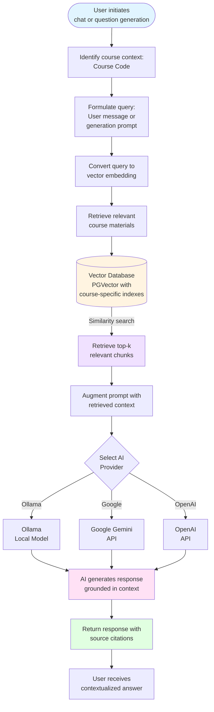

```mermaid
flowchart TB
    Start([User initiates<br/>chat or question generation]) --> Identify[Identify course context:<br/>Course Code]
    
    Identify --> Query[Formulate query:<br/>User message or<br/>generation prompt]
    
    Query --> Embed[Convert query to<br/>vector embedding]
    
    Embed --> Retrieve[Retrieve relevant<br/>course materials]
    
    Retrieve --> VectorDB[(Vector Database<br/>PGVector with<br/>course-specific indexes)]
    
    VectorDB -->|Similarity search| Context[Retrieve top-k<br/>relevant chunks]
    
    Context --> Augment[Augment prompt with<br/>retrieved context]
    
    Augment --> AIProvider{Select AI<br/>Provider}
    
    AIProvider -->|Ollama| Ollama[Ollama<br/>Local Model]
    AIProvider -->|Google| Google[Google Gemini<br/>API]
    AIProvider -->|OpenAI| OpenAI[OpenAI<br/>API]
    
    Ollama --> Generate[AI generates response<br/>grounded in context]
    Google --> Generate
    OpenAI --> Generate
    
    Generate --> Response[Return response with<br/>source citations]
    
    Response --> User[User receives<br/>contextualized answer]
    
    style Start fill:#e1f5ff
    style VectorDB fill:#fff4e1
    style Generate fill:#ffe1f5
    style Response fill:#e1ffe1
    style Context fill:#f0e1ff
```