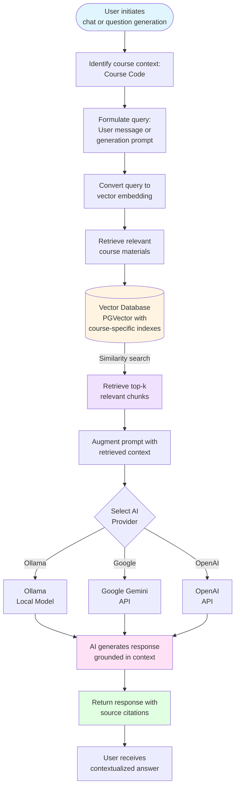

# Retrieval-Augmented Generation (RAG) System: High-Level Overview

## System Purpose

This system implements Retrieval-Augmented Generation (RAG) to ground AI responses in course-specific materials. By retrieving relevant context from course documents stored in a vector database, the system minimizes hallucinations and ensures AI-generated content aligns with actual course materials.

## Core RAG Workflow

## Key Components

### 1. **Vector Database (PGVector)**
   - Stores course materials as vector embeddings
   - Maintains separate indexes per course for optimal relevance
   - Enables efficient similarity search using cosine distance
   - Supports course isolation to ensure context remains course-specific

### 2. **Embedding Generation**
   - Course materials are processed and converted to vector embeddings
   - Documents are chunked into manageable segments
   - Each chunk is embedded and stored with metadata (course code, source document, etc.)
   - Query text is embedded using the same model for consistent similarity matching

### 3. **Retrieval Process**
   - User query is converted to a vector embedding
   - Similarity search identifies top-k most relevant document chunks
   - Retrieved chunks are filtered by course code to maintain isolation
   - Context is ranked and selected based on similarity scores

### 4. **Augmentation & Generation**
   - Retrieved context is injected into the AI prompt
   - System prompt instructs AI to ground responses in provided context
   - AI model generates response using both retrieved context and its training knowledge
   - Source citations are included to show which documents informed the response

## System Architecture

### User Interface Layer
- **Chat Interface**: Users interact with course-aware AI assistant
- **Question Generation**: Instructors generate questions using RAG-enhanced prompts
- **Course Selection**: Users specify course context for all interactions

### Integration Layer
- **EduAI Service Client**: Thin client that proxies requests to external EduAI API
- **API Key Management**: Handles provider-specific API keys (Google, OpenAI, Ollama)
- **Request Routing**: Routes chat and question generation requests with course context

### External EduAI Service
- **RAG Engine**: Manages vector database, retrieval, and augmentation
- **Multi-Provider Support**: Integrates with multiple AI providers
- **Course Management**: Maintains course-specific vector indexes and metadata
- **Streaming Support**: Provides real-time response streaming for chat interactions

### Data Storage
- **Vector Embeddings**: Course materials stored as high-dimensional vectors
- **Metadata**: Document sources, course associations, timestamps
- **Course Isolation**: Separate vector spaces per course for security and relevance

## RAG Process Flow

### 1. **Document Ingestion** (Setup Phase)
   - Course materials are uploaded to the system
   - Documents are parsed and chunked into semantic segments
   - Each chunk is embedded using an embedding model
   - Embeddings are stored in PGVector with course-specific indexing

### 2. **Query Processing** (Runtime)
   - User submits query with course code
   - Query text is embedded using the same embedding model
   - Similarity search finds relevant chunks from the course's vector index
   - Top-k chunks are retrieved and ranked by relevance

### 3. **Context Augmentation**
   - Retrieved chunks are formatted as context
   - Context is prepended to the user's query
   - System prompt instructs AI to prioritize retrieved context
   - Full augmented prompt is sent to selected AI provider

### 4. **Response Generation**
   - AI model processes augmented prompt
   - Response is generated using retrieved context as primary source
   - Source citations are extracted and included in response
   - Response is returned to user with citations

## Benefits of RAG in This System

### 1. **Accuracy**
   - Responses are grounded in actual course materials
   - Reduces hallucinations by constraining AI to retrieved context
   - Ensures alignment with course-specific terminology and concepts

### 2. **Course-Specific Context**
   - Each course maintains its own vector index
   - Responses are automatically scoped to relevant course materials
   - Supports multiple courses without cross-contamination

### 3. **Transparency**
   - Source citations show which documents informed the response
   - Users can verify information against original course materials
   - Builds trust through traceability

### 4. **Flexibility**
   - Works with multiple AI providers (Ollama, Google Gemini, OpenAI)
   - Supports both chat and question generation use cases
   - Adapts to different course structures and content types

### 5. **Efficiency**
   - Vector similarity search is fast and scalable
   - Only relevant context is retrieved, reducing token usage
   - Course isolation enables parallel processing

## Use Cases

### Chat with Course Materials
- Students ask questions about course content
- AI retrieves relevant sections from course materials
- Responses are grounded in actual course documents
- Source citations allow students to verify information

### Question Generation
- Instructors generate questions based on course topics
- RAG retrieves relevant course material sections
- AI generates questions that align with course content
- Questions maintain consistency with course terminology and concepts

### Content Extraction
- Extract questions from uploaded documents
- RAG provides context about course topics and structure
- Extracted questions are automatically categorized and tagged
- Maintains alignment with course learning objectives

## Quality Assurance

1. **Relevance**: Retrieved chunks are ranked by similarity to ensure relevance
2. **Course Isolation**: Strict course code filtering prevents cross-course contamination
3. **Source Attribution**: All responses include citations to source documents
4. **Provider Flexibility**: Multiple AI providers ensure reliability and choice
5. **Error Handling**: Graceful fallbacks when retrieval or generation fails

## Technical Implementation Details

- **Vector Database**: PostgreSQL with PGVector extension
- **Embedding Model**: Provider-specific (typically Google Generative AI for embeddings)
- **Similarity Metric**: Cosine similarity for vector comparison
- **Retrieval Strategy**: Top-k retrieval with course code filtering
- **Chunking Strategy**: Semantic chunking with overlap for context preservation
- **API Integration**: RESTful API with streaming support for real-time responses
