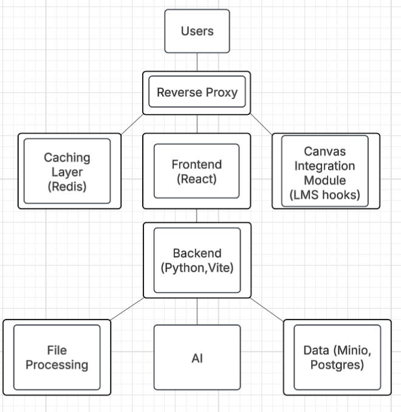

# Question Maker System – Updated Architecture (Revised)

_High-level architecture showing new components (Reverse Proxy, Redis, LMS hooks) and improved containerization._

---

## Architecture Components

### **1. User Layer**

- Teachers upload educational documents.
- Create/manage classes and exams.
- Review AI-generated questions, validation results, and AISA metrics.

### **2. Reverse Proxy Layer**

- **Nginx** serving as the single entry point.
- Routes `/` → Frontend, `/api` → Backend, `/lms` → LMS integration.
- Handles TLS termination, static asset serving, CORS, and rate limiting.
- Supports WebSockets for real-time AI streaming.

### **3. Frontend Layer**

- **React 18 + TypeScript SPA** (bundled with Vite).
- Tailwind CSS + Radix UI components.
- Real-time UI updates with streaming progress from backend.
- Communicates only through the Reverse Proxy.

### **4. Backend Layer (Orchestrator API)**

- **FastAPI (Python)** for business logic and orchestration.
- Coordinates requests between microservices.
- Handles:
  - Authentication (JWT/OAuth2 within backend).
  - File processing orchestration.
  - Concept/Question/Quiz/AISA/Evaluation services.
  - Data persistence and retrieval.
- Offloads long-running tasks to workers via Redis + RQ/Celery.

### **5. Caching Layer**

- **Redis** in-memory store for:
  - **AI prompt/embedding caching** (saves token usage and latency).
  - Job queue management for long OCR/AI tasks.
  - Rate limiting and API quotas.
  - Session/OTP tracking and JWT blacklisting.
  - Pub/Sub for real-time progress updates.

### **6. File Processing Layer**

- Document preprocessing:
  - **PDFs** via PyPDF2/PDF Plumber.
  - **DOCX** via python-docx.
  - **PPTX** via python-pptx.
  - **OCR** via Tesseract + pdf2image.
- Extracts text, chunking, and metadata.
- Stores canonical text and embeddings in Postgres (pgvector).

### **7. AI Microservices Layer**

- **Concept Service** → derive concepts/outcomes (inspired by ConQuer `generate_concept.py`).
- **Question Service** → generate MCQ/SA/Essay with rationale and difficulty (inspired by ConQuer `generate_question.py`).
- **Quiz Orchestrator Service** → assembles balanced variants (ConQuer `wiki.py`).
- **AISA Runner Service** → simulates AI Student Agents taking quizzes.
- **Evaluation Service** → computes difficulty, fairness, discrimination, solve-rates, time metrics.
- **Provider Proxy**:
  - Groq (Llama 3.3 70B) – primary.
  - OpenAI (GPT-4o-mini) – fallback.
  - Alternative provider (replace DeepSeek).
- **Local Models**:
  - Classification (BART-large-mnli).
  - Embeddings (Sentence Transformers).
  - Difficulty scoring (custom classifier).

### **8. Data Layer**

- **PostgreSQL + pgvector**:
  - Users, classes, exams, generated questions, validation metrics, embeddings.
  - Prompt/response registry for reproducibility and analytics.
- **MinIO**:
  - Stores uploaded documents and related assets.
- Redis used only for ephemeral/cache state.

### **9. LMS Integration Layer**

- **Canvas/Moodle/Blackboard Integration Module**:
  - Webhooks and API connectors for LMS platforms.
  - Syncs classes, exams, and results with external learning tools.
- **Exporter Sub-Layer**:
  - Renders quizzes to Canvas QTI, Word, PDF.
  - Deterministic rendering for version control.

---

## Data Flow

1. **Document Upload** → Reverse Proxy → Backend → File Processing → Extracted text + embeddings stored.
2. **Concept Service** → returns concepts/outcomes.
3. **Question Service** → generates items linked to concepts.
4. **Quiz Orchestrator** → assembles balanced variants.
5. **AISA Runner** → simulates student performance on variants.
6. **Evaluation Service** → aggregates metrics (difficulty, discrimination, reliability, parity).
7. **Caching Layer** → caches repeated prompts/embeddings.
8. **Data Layer** → stores all metadata, provenance, analytics.
9. **User Interface** → Frontend streams job status via Redis pub/sub.
10. **Exporter/LMS Hooks** → deliver QTI/PDF/Word to LMS.

---

## Key Improvements Over Previous Architecture

- 🔄 **Microservice Split**: Concept, Question, Quiz, AISA, and Evaluation services for modularity and scaling.
- ⚡ **Prompt & Embedding Caching**: Redis L1 cache + Postgres registry for provenance.
- 🎯 **Evaluation Service**: adds AISA-based dynamic validation (solve-rate, time, reliability, parity).
- 📚 **Exporter Layer**: deterministic output for LMS integration (Canvas QTI, PDF, Word).
- 🧩 **pgvector Integration**: supports RAG on uploaded content.
- 🔒 **Auth Simplification**: folded into backend with Redis support.
- 🐳 **Containerization**: per-service Dockerfiles + Compose for dev; K8s ready later.

---

## Technology Stack Summary

| Layer                | Technology                                               | Purpose                               |
| -------------------- | -------------------------------------------------------- | ------------------------------------- |
| **Reverse Proxy**    | Nginx                                                    | Routing, TLS, CORS, static serving    |
| **Frontend**         | React 18 + TypeScript + Vite                             | User interface and interactions       |
| **Backend**          | FastAPI (Python)                                         | Public API and orchestration          |
| **Caching**          | Redis + RQ/Celery                                        | AI caching, job queue, pub/sub        |
| **File Processing**  | PyPDF2, python-docx, python-pptx, Tesseract              | Document parsing and OCR              |
| **AI Microservices** | FastAPI apps (Concept, Question, Quiz, AISA, Evaluation) | Question generation, validation, AISA |
| **Database**         | PostgreSQL + pgvector                                    | Structured data + embeddings          |
| **File Storage**     | MinIO                                                    | Document and media storage            |
| **LMS Integration**  | Canvas/Moodle/Blackboard API/Webhooks                    | Third-party system integration        |
| **Authentication**   | JWT + OAuth2 (within backend)                            | User security and access control      |

---
